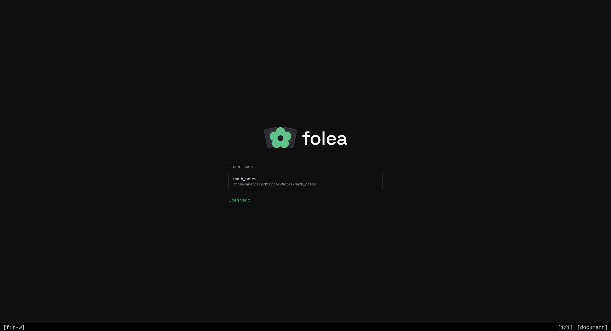
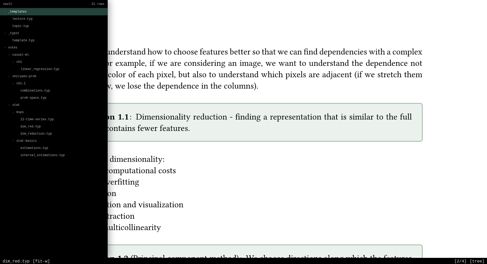
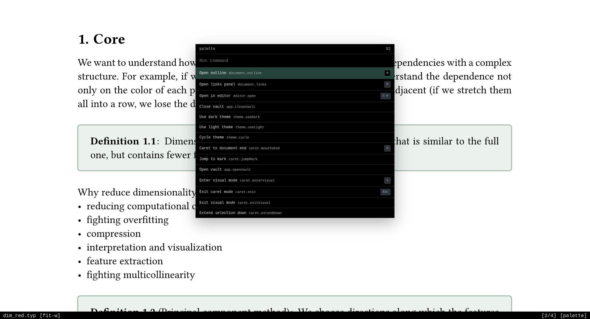
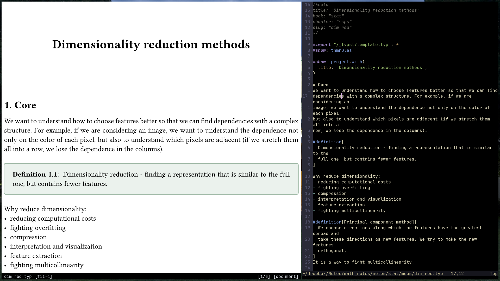

<p align="center">
<picture>
  <source media="(prefers-color-scheme: dark)" srcset="assets/logo/logo-dark.svg">
  <source media="(prefers-color-scheme: light)" srcset="assets/logo/logo-light.svg">
  
</picture>
</p>

**folea** is a keyboard-driven, minimalist note manager for **[Typst](https://typst.app)**
notes. It is a read/navigation shell for a plain directory of `.typ` files: open a vault,
search, jump, browse links, and read rendered Typst.

folea **does not edit notes in-app**. The `editor.open` command (`<C-e>` by default) launches the
user's external terminal/editor command, normally Neovim with tinymist.

## Screenshots









## Install

### Development packages

> **These packages track Folea's `develop` branch and may contain unstable or incomplete changes.**

Scoop, Homebrew HEAD, AUR, authenticated APT/DNF repositories, and AppImage instructions are in
[Development packages](docs/development-packages.md). Every installed build exposes its exact source
commit through `--build-info`.

### From source

```bash
npm install
npm run app:install
npm run app:uninstall 
```

`app:install` builds an unpacked app and registers it with the OS: 
- on Linux it writes
`~/.local/share/folea/unpacked`, `~/.local/bin/folea`, the icon, and
`~/.local/share/applications/folea.desktop`; 
- on macOS it copies `folea.app` to `~/Applications`;
- on Windows it copies the app to `%LOCALAPPDATA%\Programs\folea` and creates a Start Menu shortcut.

### Build a package

```bash
npm run package 
```

Targets are Linux AppImage + deb, Windows NSIS, and macOS dmg. Packages are unsigned — on
macOS use **Open Anyway** in System Settings → Privacy & Security; on Windows SmartScreen may require
**More info → Run anyway**.

## Configuration

Global config lives in Electron's `userData` directory:

- Linux: `~/.config/folea/`
- macOS: `~/Library/Application Support/folea/`
- Windows: `%APPDATA%/folea/`

Vault-local prefs may override global prefs key by key from `<vault>/.folea/prefs.config`.

`prefs.config`:

```ini
search.vaultCaseSensitive = false
search.inFileCaseSensitive = false
theme = dark
```

`editor.command` opens the current note when you press `<C-e>`. It defaults to VS Code
(`code --reuse-window`). `%FILE%` is replaced with the note path; `FOLEA_EDITOR_CMD` env var
overrides it at runtime.

**VS Code** (default):

```ini
editor.command = code --reuse-window %FILE%
```

**Neovim**:

```ini
editor.command = kitty -e nvim --listen %SOCK% %FILE%
```

`%SOCK%` is replaced with a vault-scoped socket path. With `--listen`, folea reuses an
already-open nvim session — subsequent `editor.open` calls switch the buffer instead of opening
a new window. Omit `%SOCK%` if you don't need session reuse.

`keys.config`:

```text
document.scrollHalfDown <C-f>
view.toggleTree t
editor.open e
```

The command ID is the same ID shown in the command palette. 

<details>
<summary><strong>Default Key Bindings</strong></summary>

All bindings are remappable via `keys.config`. The command ID shown in the palette is the
key used for remapping.

### Document (reading mode)

| Key | Action |
|---|---|
| `j` / `k` | Scroll down / up |
| `h` / `l` | Scroll left / right |
| `Ctrl+d` / `Ctrl+u` | Scroll half page down / up |
| `gg` / `G` | Jump to top / bottom |
| `n` / `N` | Next / previous search match |
| `:` | Command palette |
| `/` | In-file search |
| `Ctrl+p` | Quick open note |
| `Ctrl+b` | Toggle file tree |
| `o` | Document outline |
| `b` | Links panel |
| `s` | Enter caret mode |
| `Ctrl+e` | Open current note in editor |
| `=` | Fit page width |
| `+` / `-` | Zoom in / out |

### File tree

| Key | Action |
|---|---|
| `j` / `k` | Move down / up |
| `l` / `h` | Expand / collapse |
| `gg` / `G` | First / last item |
| `/` | Filter tree |
| `Enter` | Open selected note |

### Caret mode (`s` to enter)

| Key | Action |
|---|---|
| `h` / `j` / `k` / `l` | Move caret |
| `{` / `}` | Previous / next paragraph |
| `gg` / `G` | Document start / end |
| `v` | Enter visual selection |
| `y` | Yank selection (in visual mode) |
| `Enter` / `gd` | Follow link under caret |
| `m<x>` | Set mark `x` |
| `'<x>` | Jump to mark `x` |

</details>

## Development

```bash
npm install
npm run dev
npm run typecheck
npm run lint
npm test
npm run test:e2e
npm run rebuild
```

`npm run test:e2e` launches Electron through Playwright. 

### Performance measurements

`npm run measure:baselines` writes machine-readable results to `.perf-results/`. The link-graph
measurement uses fixed synthetic vaults of 20, 50, and 100 notes by default; override them with
`FOLEA_GRAPH_VAULT_SIZES`. The input metric is intentionally named `input-next-frame`: it measures
keydown dispatch through the next animation-frame callback and is a responsiveness proxy, not a
compositor-paint timestamp. Committed budgets and reference measurements live in
`performance/baselines.json`.

## Contributing

The repository is currently **read-only** — no external contributions are accepted while core
features are being built. Issues and PRs will be ignored for now. This will change once the
project reaches a stable baseline; the notice here will be updated accordingly.

## License

[Apache-2.0](LICENSE). Bundled third-party components are attributed in [`NOTICE`](NOTICE).
